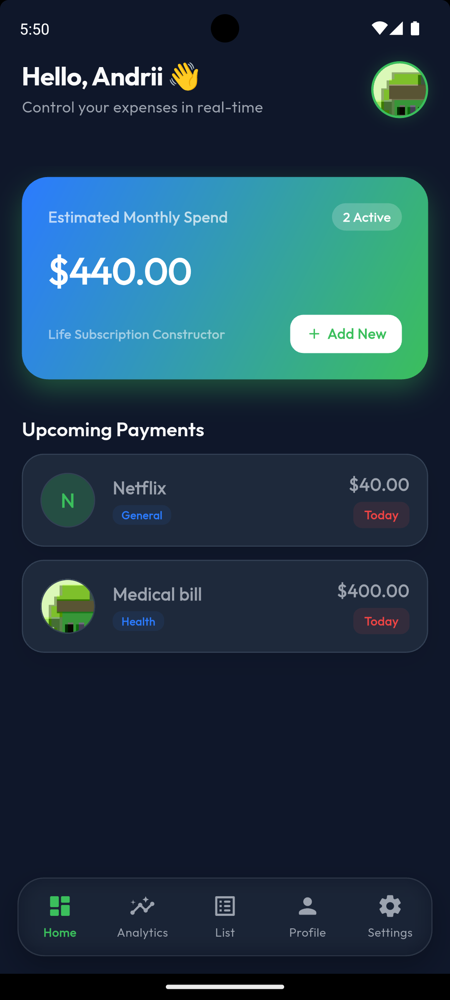
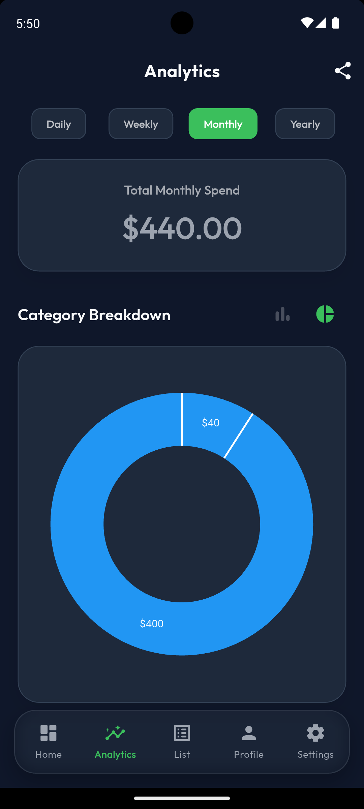
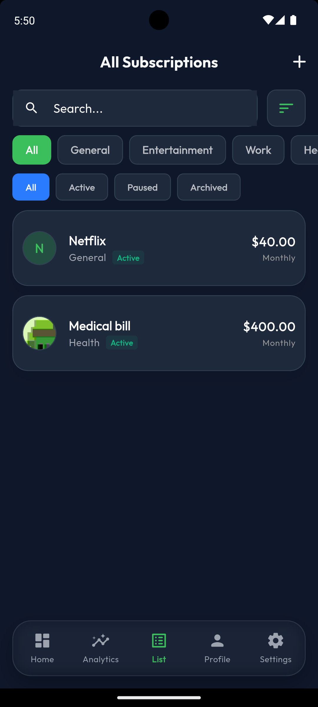
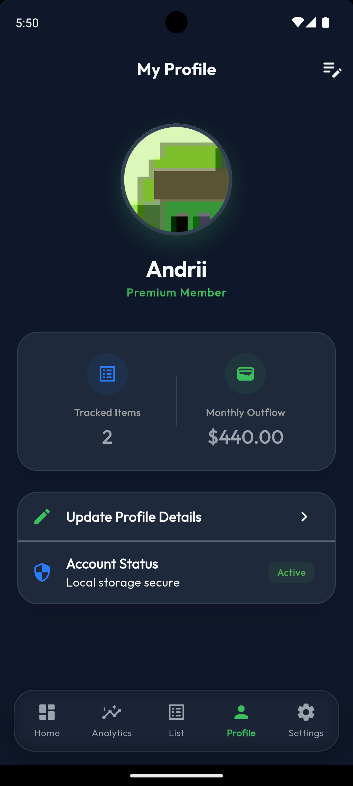
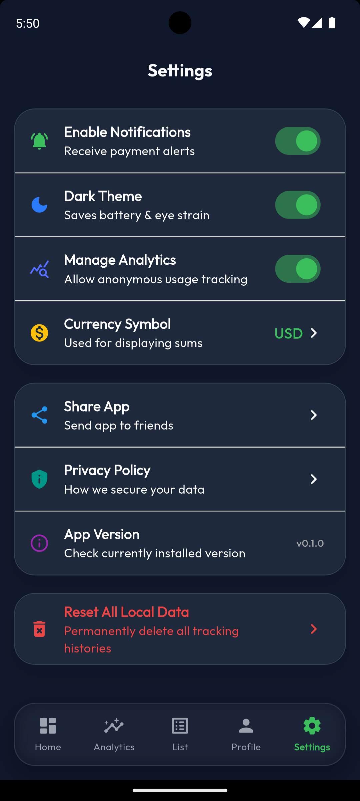
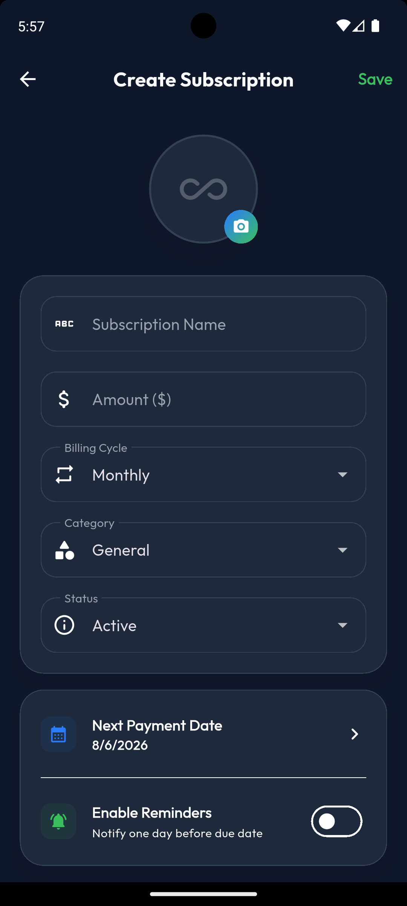

## Life Subscription Constructor

Take control of your recurring expenses with a smart subscription manager. Never miss a payment and optimize your spending with intuitive analytics.
---

## 🚀 Status
- **Current Version:** 1.0.0
- **Build:** Flutter

## 📖 Overview
A specialized mobile solution developed for tracking recurring subscriptions and managing personal financial outflows. Designed with a premium, fully responsive UI to engage users through interactive financial analytics, smart payment reminders, and seamless CSV exporting.

## ✨ Key Features
* **Smart Subscription Tracking:** Keep all your subscriptions in one place. Automatically track next payment dates, periods, and categories.
* **Payment Reminders:** Get timely local push notifications before your next billing cycle to avoid unwanted charges.
* **Advanced Analytics:** Gain data-driven insights into your recurring spending habits with interactive charts, category breakdowns, and period filtering (Daily, Weekly, Monthly, Yearly).
* **Premium UI/UX:** A stunning, modern interface with seamless Dark & Light mode adaptation, glassmorphism effects, and engaging micro-animations.
* **Export & Share:** Instantly generate detailed CSV reports of your subscriptions and share them across your devices.
* **Personalized Dashboard:** A central hub to view your active subscriptions, monthly outflow, and quick action shortcuts.

## 📸 Screenshots

  
  
  
  
  
  

